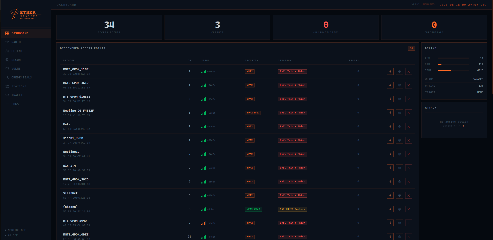
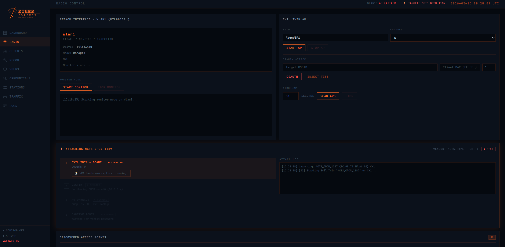
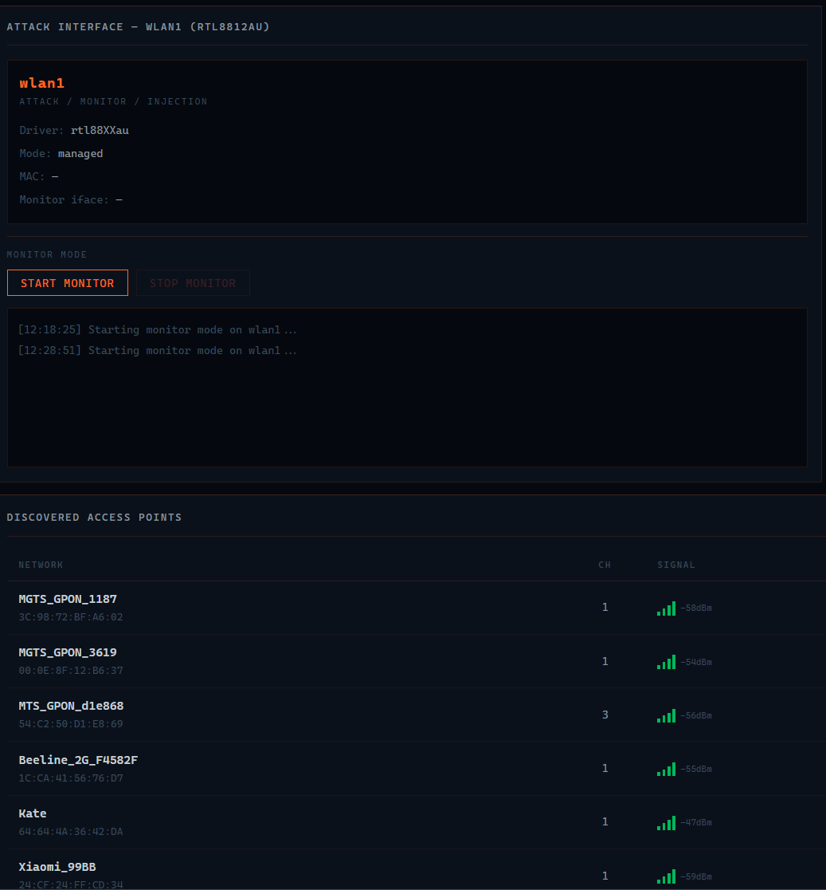

# EtherSlasher

<p align="center">
  
</p>

<p align="center">
  Open-source educational WiFi security audit platform running on Orange Pi RV2 (RISC-V)
</p>

---

## Screenshots

### Dashboard — Live AP Scan with Strategy Engine


### Radio Control — Active Evil Twin + Handshake Capture


### Radio Control — Monitor Mode


---

## Features

| Module | Capability |
|--------|-----------|
| **WiFi Recon** | Passive AP scan via airodump-ng, station/client detection, probe request logging |
| **Strategy Engine** | Auto-selects attack strategy per AP: Direct MITM (OPN), WEP IV Recovery, SAE PMKID Capture (WPA3), Evil Twin + Phish (WPA2), Handshake Capture |
| **Evil Twin** | Cloned AP with hostapd, DHCP via dnsmasq, captive portal redirect |
| **Handshake Capture** | Auto-started airodump-ng cap + aircrack-ng polling, hcxpcapngtool export |
| **Traffic Analysis** | HTTP request logging from victims (10.0.0.x), DNS query tailing |
| **L2/L3 Recon** | ARP scan on victim subnet, station→AP association mapping |
| **Captive Portal** | Router-branded templates: MGTS, MTS, Keenetic, TP-Link, Huawei, Xiaomi, Beeline |
| **Live Dashboard** | Node.js / Socket.io, Chart.js activity telemetry, EVA-inspired dark UI |

---

## Architecture

```
┌─────────────────────────────────────┐
│          Orange Pi RV2              │
│                                     │
│  ┌──────────┐    ┌───────────────┐  │
│  │ Node.js  │◄───│ radio-worker  │  │
│  │ :8080    │    │ (Python)      │  │
│  │ Express  │    │ airodump-ng   │  │
│  │ Socket.io│    │ → SQLite WAL  │  │
│  └────┬─────┘    └───────────────┘  │
│       │                             │
│  ┌────▼─────┐    ┌───────────────┐  │
│  │ SQLite   │    │  hostapd      │  │
│  │ etherslasher.db│ dnsmasq      │  │
│  └──────────┘    │  iptables     │  │
│                  └───────────────┘  │
│                                     │
│  wlan0 (managed)  wlan1 (RTL8812AU) │
└─────────────────────────────────────┘
```

**Stack:**
- **Backend** — Node.js 18, Express, Socket.io, sqlite3 (async WAL)
- **Radio worker** — Python 3, airodump-ng, aircrack-ng
- **Frontend** — Vanilla JS SPA, Chart.js, EVA-inspired monochrome orange theme
- **OS** — Orange Pi RV2 running Debian (RISC-V / riscv64)
- **Adapter** — Alfa AWUS036ACH (RTL8812AU), monitor + injection capable

---

## Pages

- **Dashboard** — AP overview with strategy badges, live activity chart, system stats
- **Radio** — Monitor/attack control, Evil Twin AP, deauth, airodump scan
- **Clients** — Connected victim tracking
- **Recon** — Passive network intelligence
- **Stations** — WiFi client devices: MACs, associated APs, probe requests, signal
- **Traffic** — Live HTTP log, DNS queries, ARP table from victim subnet
- **Vulns** — Detected vulnerabilities
- **Credentials** — Captured portal submissions
- **Logs** — Real-time event stream

---

## Setup

### Requirements

- Orange Pi RV2 (or any Linux SBC with USB WiFi adapter)
- RTL8812AU adapter (Alfa AWUS036ACH / TP-Link T2U Plus)
- `aircrack-ng` suite, `hostapd`, `dnsmasq`, `arp-scan`
- Node.js 18+, Python 3.9+

### Install

```bash
git clone https://github.com/sl4sh73r/EtherSlasher-pi.git /opt/etherslasher
cd /opt/etherslasher/web && npm install
cp scripts/*.service /etc/systemd/system/
systemctl enable --now etherslasher-web etherslasher-radio-worker
```

Dashboard available at `http://<device-ip>:8080`

---

## ⚠️ Authorized Use Only

This tool is intended **exclusively** for:
- Networks you own
- Networks you have explicit written authorization to test
- Isolated lab environments built for education and research

Running EtherSlasher against networks without authorization is illegal in virtually every jurisdiction and violates this project's license. The author assumes no liability for misuse.

---

## Academic Context

Developed as part of coursework / thesis research at  
**MIREA — Russian Technological University**

## License

MIT — see [LICENSE](LICENSE)
